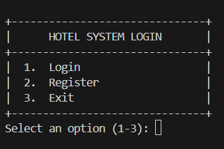
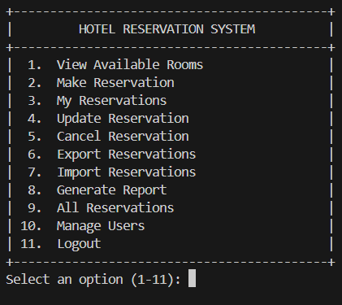
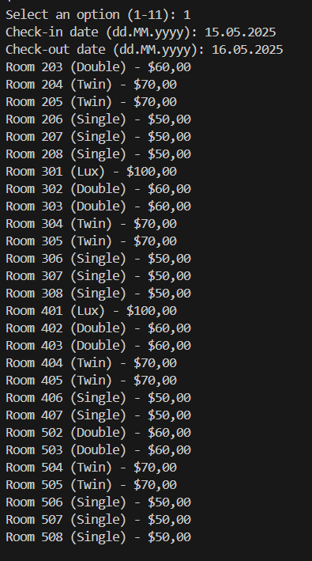
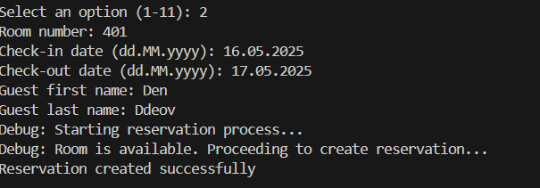
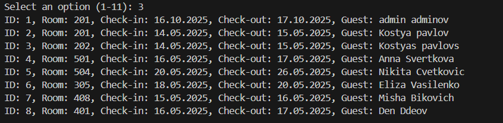
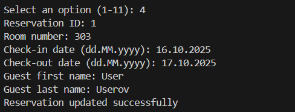
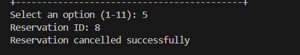

# Hotel Reservation System

## Description
A hotel reservation management application built in Java, utilizing Apache POI for Excel-based data storage and a console-based interface. It supports creating, viewing, updating, and deleting reservations, managing users and rooms, importing/exporting data in Excel format, and generating reports.

## Author
Batyr Batyrov

## Project Goals
- Provide efficient management of reservations, rooms, and users through a console interface.
- Implement role-based access (administrator and user).
- Support data import/export and report generation.

## Requirements
- User authentication via login and password.
- Role-based access: administrator (full access) and user (limited access).
- Create, view, update, and delete reservations.
- Display available rooms for selected dates.
- Manage room prices (administrators only).
- Manage users: add, update roles, delete (administrators only).
- Import and export reservation and user data in Excel format.
- Generate reports on system status (user, reservation, and room statistics).
- Console-based interface with user interaction.
- Log all operations to a file.

## Installation and Setup

### Required Software
- Java 17 or higher
- Apache POI library
- Maven

### Installation Steps
- **Project Build:**
  - Clone the repository: `git clone https://github.com/Batyr21a/Hotel_Reservation_System`
  - Navigate to the project folder: `cd Hotel_Reservation_System`
  - Build the project: `mvn clean install`
- **Run the Application:**
  - Run the application: `mvn exec:java -Dexec.mainClass="com.example.HotelApp"`
- **Test Credentials:**
  - Administrator: login `admin`, password `admin`
  - User: login `user`, password `user`

## Project Structure
- `com.example`: Main package containing application logic.
  - `ExcelUtils.java`: Handles Excel file operations.
  - `HotelApp.java`: Main application class with console interface.
  - `ReservationService.java`: Manages reservation operations.
  - `UserService.java`: Manages user operations.
- `resources`: Configuration and log files (e.g., logs/hotel.log).

## Key Features
- **Authentication:** Login with role-based access.
- **Reservations:** Create, view, update, and delete reservations via console.
- **Room Management:** Update prices (administrators only).
- **User Management:** Add, update roles, delete (administrators only).
- **Import/Export:** Save and load data in Excel format.
- **Reports:** Statistics on users, reservations, and rooms.
- **Logging:** Operations logged to `logs/hotel.log`.

## Documentation

### Algorithms
- **Available Room Search:** Checks Excel data to exclude booked rooms for specified dates.
- **Excel Processing:** Validates data format and handles file I/O.

## Data Structures
- **In-Memory:** `List<Map<String, Object>>` for temporary data storage from Excel.
- **File-Based:** Excel files (`users.xlsx`, `rooms.xlsx`, `reservations.xlsx`) for persistent storage.

## Modules
- **ExcelUtils:** Manages reading and writing to Excel files.
- **ReservationService:** Handles reservation creation, updates, and deletions.
- **UserService:** Manages user authentication and administration.
- **HotelApp:** Controls the console-based user interface.

## Challenges and Solutions
- **Challenge:** Incorrect Excel format during import.
  - **Solution:** Validate headers and data types in `ExcelUtils`, handle exceptions.
- **Challenge:** File access errors.
  - **Solution:** Implement try-with-resources for file handling and log errors.

## Test Cases
- **Invalid password login:** Displays an error message.
- **Booking an occupied room:** Reservation is rejected.
- **Importing invalid Excel:** Shows an error.
- **Updating room price:** Reflected in the Excel file.

### Screanshots 

